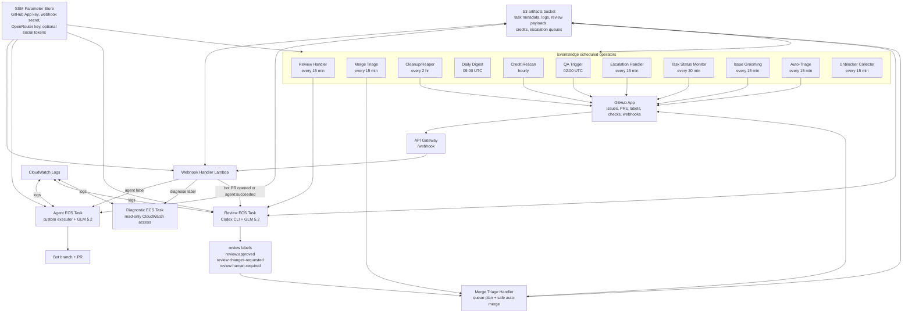
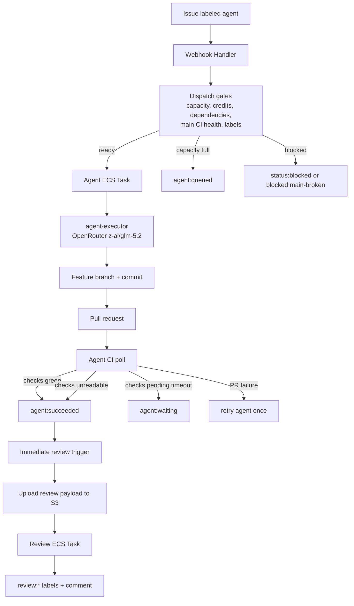
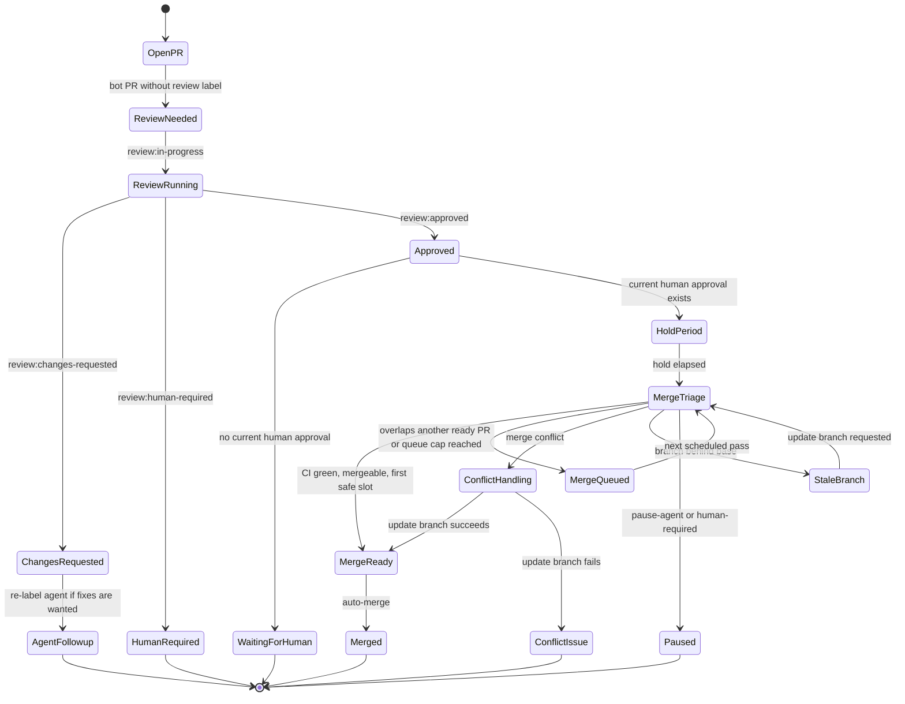

# GitHub Agent Architecture

This document maps the deployed agent system: the webhook control plane, custom
executor runtime tasks, scheduled operators, review/merge gates, and artifact stores.

## System Overview

## Issue-To-PR Flow

## Review And Merge Gate

## Runtime Components

| Component | File | Purpose |
| --- | --- | --- |
| CDK stack | `infra/lib/stack.ts` | Defines VPC, ECS, ECR, S3, API Gateway, Lambdas, EventBridge rules, and shared monitored repo configuration. |
| Webhook handler | `infra/lib/webhook-handler.ts` | Handles GitHub events, dispatches agent/diagnostic/review tasks, checks gates, processes PR lifecycle events. |
| Agent container | `agent/entrypoint.sh` | Runs the custom executor for issues and PR work, creates branches/PRs, polls CI, writes task artifacts, updates labels. |
| Review container | `agent/review-entrypoint.sh` | Loads review payloads, runs Codex review analysis, posts feedback, applies review labels. |
| Review handler | `infra/lib/review-handler.ts` | Scheduled review sweep that launches review tasks for coding-agent PRs. |
| Merge triage handler | `infra/lib/merge-triage-handler.ts` | Scheduled merge queue planner; labels merge readiness, stores queue snapshots, updates stale branches, and auto-merges one safe PR per repo pass. |
| Merge triage policy | `infra/lib/merge-triage-policy.ts` | Deterministic queue policy for hold-period, approval, overlap, conflict, and risk decisions. |
| Triage handler | `infra/lib/triage-handler.ts` | Labels and sizes open issues; can split or flag work that is too broad. |
| Grooming handler | `infra/lib/grooming-handler.ts` | Enforces issue-shape and acceptance-criteria limits. |
| Cleanup handler | `infra/lib/cleanup-handler.ts` | Reaps stale tasks, retries recoverable failures, refunds timed-out runs, drains queued work. |
| Task status handler | `infra/lib/task-status-handler.ts` | Periodic health checks for running tasks and escalation triggers. |
| Escalation handler | `infra/lib/escalation-handler.ts` | Maintains the human-attention queue. |
| Credit rescan | `infra/lib/credit-rescan-handler.ts` | Rechecks blocked issues when credits are available again. |
| Daily digest | `infra/lib/daily-digest-handler.ts` | Publishes daily activity and credit summaries. |
| QA trigger | `infra/lib/qa-trigger.ts` | Creates nightly QA work. |
| Unblocker collector | `infra/lib/unblocker/collector.ts` | Captures failure graph snapshots and metrics. |

## Operational Contracts

- The trigger label is `agent`; status labels are `agent:running`,
  `agent:queued`, `agent:waiting`, `agent:failed`, and `agent:succeeded`.
- Review tasks consume `REVIEW_PAYLOAD_S3_KEY`; inline `REVIEW_PAYLOAD` remains
  as a rolling-deploy fallback.
- Immediate and scheduled review launches both add `review:in-progress` to avoid
  duplicate review tasks.
- CI visibility failures from missing GitHub App scopes are not treated as
  pending CI inside the agent task. They mark the coding work as complete and
  defer final safety to review and branch protection.
- Merge triage applies exactly one `merge:*` label to tracked coding-agent PRs:
  `merge:ready`, `merge:queued`, `merge:waiting`, `merge:blocked`,
  `merge:conflict`, or `merge:stale`.
- Merge requires `review:approved`, no blocking labels, elapsed hold period, an
  open and mergeable PR, a current human approval, no protected paths, and the
  first safe merge slot for the PR's overlapping file group.
- Merge triage merges at most one ready PR per repository per scheduled pass,
  then rechecks the remaining queue after GitHub updates the base branch.
- Merge triage writes the latest plan to
  `merge-triage/<owner>/<repo>/latest.json` in the artifacts bucket.
- Protected paths such as workflows, infra, secrets, keys, and deploy scripts
  force `review:human-required`.

## Required GitHub App Permissions

The control plane requires these repository permissions:

- Contents: read/write
- Issues: read/write
- Pull requests: read/write
- Workflows: read/write
- Commit statuses: read-only
- Checks: read-only
- Metadata: read-only

After changing app permissions, the repository or organization owner must
approve the updated installation before new installation tokens receive those
scopes.
