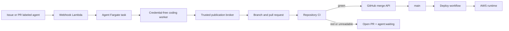
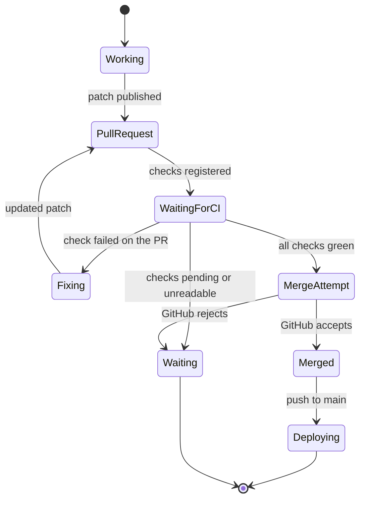

# GitHub Agent Architecture

The live system is designed around one governance surface: a GitHub pull
request. CI and repository rules decide whether it can merge. The agent does not
add a second approval system.

## End-to-end flow

The broker, rather than the model worker, holds GitHub credentials. It rebuilds
the worker's patch in a clean clone before publishing it. The same rule applies
to AWS credentials.

## Decision boundary

There are no review labels, protected-path forms, hold periods, or custom queue
slots in this decision. Repository rules can still reject a merge. That keeps
the safety policy local to each repository and visible in GitHub.

## Active components

| Component | Source | Purpose |
| --- | --- | --- |
| CDK stack | `infra/lib/stack.ts` | Defines network, compute, storage, webhooks, and scheduled operations. |
| Webhook handler | `infra/lib/webhook-handler.ts` | Dispatches coding and diagnostic tasks and handles lifecycle events. |
| Agent task | `agent/entrypoint.sh` | Runs work, publishes a PR, reads CI, and requests merge. |
| Coding worker | `agent-executor` | Changes files without receiving GitHub or AWS credentials. |
| Diagnostic task | agent image with diagnostic mode | Reads CloudWatch and reports likely causes. |
| CI workflow | `.github/workflows/ci.yml` | Validates pull requests and `main`. |
| Deploy workflow | `.github/workflows/deploy.yml` | Deploys each accepted push to `main`. |

Cleanup, task status, credit, digest, and QA schedules remain operational. The
scheduled review and merge-triage rules are disabled. Their resources are kept
for one rollback window and should be removed after the direct flow is proven.

## Failure behavior

- PR-specific CI failure fails the run so the agent can correct its work.
- A failure shared with `main` leaves the PR open and explains the shared
  blocker.
- Pending or unreadable checks leave the PR open. The agent does not guess that
  CI passed.
- A rejected merge leaves the PR open and reports the GitHub blocker.
- A successful merge triggers deployment from `main`.

## Required GitHub App permissions

- Contents: read/write
- Issues: read/write
- Pull requests: read/write
- Workflows: read/write
- Commit statuses: read-only
- Checks: read-only
- Metadata: read-only

The installation owner may need to accept a permission update before new tokens
receive it.
